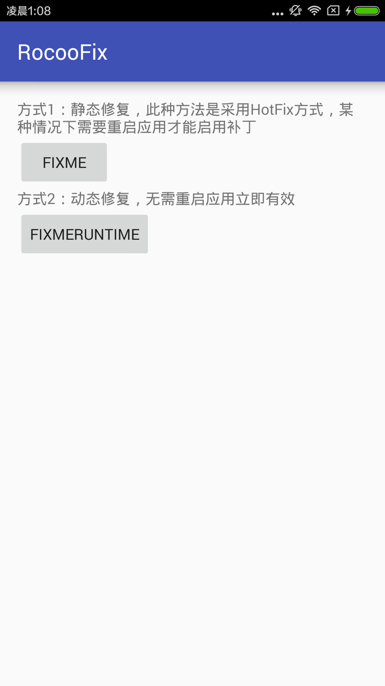

# RocooFix

Another hotfix framework

之前的HotFix项目太过简单，也有很多同学用Nuwa遇到很多问题，作者也不再修复，所以重新构建了一套工具。




## Features
* **支持两种模式**：
    1. 静态修复某种情况下需要重启应用。
    2. 动态修复，无需重启应用即可生效。
* **支持DalvikVM和ART VM**
* 制作补丁更加方便
* 支持`com.android.tools.build:gradle:1.3.0`->`com.android.tools.build:gradle:2.1.0` (解决了Nuwa 这个[issue][1])
* 支持混淆和Mulitdex
* 无需关注`hash.txt`和`mapping.txt`文件的生成和保存

动态修复使用的是Lody的Legend项目，由于Dalvik的CLASS验证导致这个HOOK框架在Dalvik虚拟机下会崩溃，但是在RocooFix框架里正好可以欺骗这个验证，所以在Dalvik下不会出现原来的崩溃问题。具体情况可以参照[这篇日志](http://dodola.github.io/2016/05/02/legend_crash/)

## TODO
* 补充单测
* 兼容性测试
* Legend 泄露问题
* 目录规则调整

## Use

```java
public class RocooApplication extends Application {
    @Override
    protected void attachBaseContext(Context base) {
        super.attachBaseContext(base);
        //打补丁
        RocooFix.init(this);
    }
}


//方案1：静态启用，一般在Application里加载补丁

RocooFix.initPathFromAssets(this, "patch.jar");

//方案2：动态打补丁，立即生效，有性能问题，适用于补丁方法数较少的情况，建议在ART虚拟机里启用该模式
RocooFix.initPathFromAssetsRuntime(this,"patch.jar");

```

## Configuration

在你项目的`build.gradle`文件里添加如下配置
```groovy
rocoo_fix {
    includePackage = ['com/dodola/rocoofix']//限制需要制作补丁的package
    excludeClass = ['BaseApplication.class']//将不需要加到patch里的类写在这里
    
    preVersionPath = '1'//注意：此项属性只在需要制作补丁的时候才需开启！！如果不需要制作补丁则需要去掉此项
    
    enable = true//注意：关掉此项会无法生成Hash.txt文件
}
```

这里主要介绍一下`preVersionPath`这个属性的作用。

`rocoo_fix`将制作补丁的步骤透明化，用户无需手动备份hash.txt文件，插件会自动根据当前的`versionCode`生成`hash.txt`和`mapping.txt`文件到指定目录，比如：

上一个版本发布的时候版本号是`1`，那么生成的文件会放在`app源码目录/rocooFix/version1/[debug]|[release]`的目录下，如果需要制作补丁那么在配置里指定`preVersionPath` 属性，它的值是上一个版本的版本号，这里的值是`1`，

然后将`build.gradle`的`versionCode`的号码修改，这里修改成`2`，只要和之前的版本不同就可以，没有具体值的要求


## Proguard

```
-keep class com.dodola.rocoofix.** {*;}
```

## Build Patch

下面演示一下使用项目demo生成补丁的制作过程

1. 假如我们需要打补丁的文件是

```java
package com.dodola.rocoosample;

public class HelloHack {

    public String showHello() {
        return "hello world";
    }
}

```

此时`build.gradle`里的`VersionCode`是`1`

![enter description here][2]


2. 运行一次应用，这时会在`app`的目录下生成如下文件：

![enter description here][3]

这里可以看做是我们已经发布版本的`hash.txt`


3. 假设我们需要修复步骤1 里的`showHello`方法，修改如下：

```java
package com.dodola.rocoosample;

public class HelloHack {

    public String showHello() {
        return "hello Hack";//此处修复，补丁加载后该方法返回hello hack
    }
}

```

4. 修改build.gradle 文件里`rocoo_fix`项，让其执行patch 的task，配置如下

```gradle
rocoo_fix {

    preVersionPath = '1'//注意：这里指定的是需要打补丁的VersionCode
    enable = true
}

```

5. 修改当前项目的`versionCode`为`2`，说明这个是一个升级fix版本。

![enter description here][4]

6. 正常发布应用，此时会在下图所示的路径中生成补丁文件：
![enter description here][5]


7. 我们可以反编译一下来确认补丁是否正常
![enter description here][6]

  
## 相关项目
[Legend](https://github.com/asLody/legend)


  [1]: https://github.com/jasonross/Nuwa/issues/65
  [2]: ./images/1464264036709.jpg "1464264036709.jpg"
  [3]: ./images/1464264178068.jpg "1464264178068.jpg"
  [4]: ./images/1464264514735.jpg "1464264514735.jpg"
  [5]: ./images/1464264669463.jpg "1464264669463.jpg"
  [6]: ./images/1464264736467.jpg "1464264736467.jpg"
